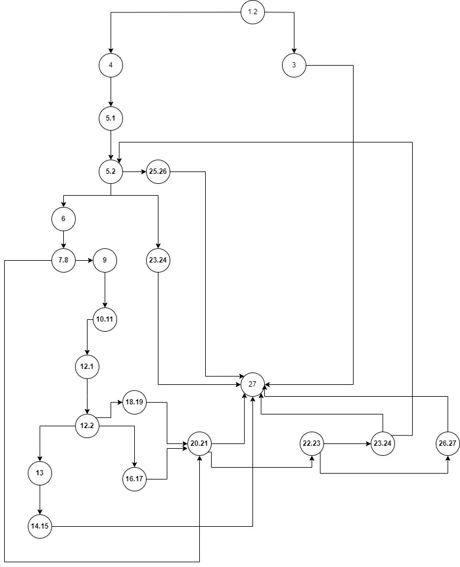

# Втора лабораториска вежба по Софтверско инженерство

### Виктор Стаменовски, бр. на индекс 215088

###  Control Flow Graph

### Цикломатска комплексност

Цикломатската комплексност на CFG во мојот случај е 10, можеме да утврдиме според овие 2 начина:
- Ф1 (број на ребра - број на јазли + 2) = 10 ... 30 ребра - 22 јазли + 2 = 10
- Ф2 (број на предикатни јазли + 1) = 10 ... 7 ифови + 2 фора + 1 = 10

### Тест случаи според критериумот Every branch/statement

Прв тест 
allItems = null, payment = any
Листата е 'null' така што ќе фрли exception и ќе излезе од програмата
така што payment не е битно колкава е вредноста.

Втор тест
allItems = [], payment = 0
Во овој тест програмата ќе врати празна листа и payment со вредност 0.

Трет тест
allitems = [], payment = -1
Во овој тест програмата ќе врати празна листа со негативна вредност на payment.

Четврт тест
аllItems[{
    name = "",
    barcode = null,
    price = "80",
    discount = "0.8"
}], 
payment = any
Овој test-case е креиран за проверка на barcode = null, името е празен стринг и barcode има 'null' вредност, така што
очекуваме да фрли exception "No barcode!"

Петти тест
аllItems[{
    name = "Test",
    barcode = "7T60321S2L5",
    price = "100",
    discount = "0.8"
}], 
payment = 100
Тука баркодот содржи букви, така да очекуваме кодот да фрли exception: "Invalid character in item barcode!"

Шести тест
аllItems[{
    name = "Test",
    barcode = "1123456789",
    price = "350",
    discount = "0.5"
}], 
payment = 150
Во овој случај веднаш под првиот for циклус sum ке биде 175, а payment 150 така да очекуваме да врати false.

Седми тест
аllItems[{
    name = "DiscountItem",
    barcode = "0123456789",
    price = "350",
    discount = "0.5"
}], 
payment = 150
Очекуваме да врати true, бидејќи имаме објект со цена над 300, попустот е поголем од 0, 
и баркодот започнува со '0'.

### Тест случаи според критериумот Multiple Condition

Во оваа функција сакаме да ги препокриеме Multiple Condition критериумите.

Прв тест
TXX: allItems != null, item.getName() = X, item.getBarcode() = X

Втор тест
FTX: allItems = null

Трет тест
FFF: allItems != null, item.getName() = null, item.getBarcode содржи недозволени знаци

Четврт тест
TFX: allItems != null, item.getName() = null, item.getBarcode = X

### Објаснување на напишаните unit tests

За да ги препокриеме тестовите во нашиот Gradle проект со помош на JUnit5 библиотеката, креирав 2 методи кои ќе ги изминат некои од Every statements и Multiple Condition критериумите. 
(item.getPrice() > 300 && item.getDiscount() > 0 && item.getBarcode().charAt(0) == '0'), треба да дизајнираме тест случаи што ги покриваат сите можни комбинации на вистинити и неточни услови за секој дел од состојбите.

Тестовите за Every statement се објаснети во погорниот параграф како функционираат, истите се напишани со assert изрази во JUnit, 
Ex. имаме T, F, X каде што означуваат True, False, и X не е битен или претставен како don't care, пример во првиот тест имаме TFF (True, False, False)
Овој test-case препокрива да ли цената е поголема од 300, попустот е 0, и исто така првиот знак во баркодот е '0', item.getPrice(): 350, item.getDiscount(): 0, item.getBarcode(): "1234567890" така што очекуваме да врати false.
